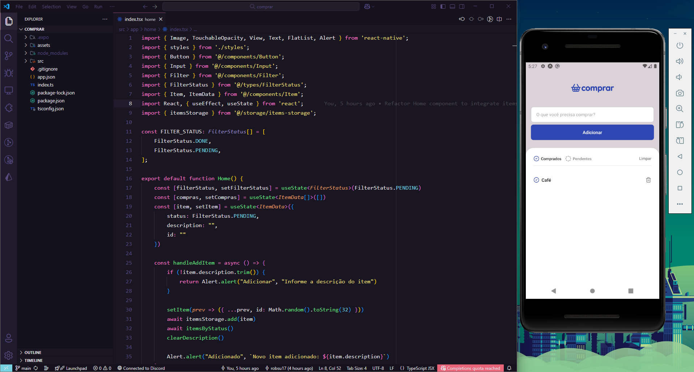

# App Lista de Compras 🛒



> Status: Concluído ✔️

Projeto de um aplicativo de lista de compras desenvolvido como parte do curso da [Rocketseat](https://www.rocketseat.com.br/). O objetivo principal foi aplicar na prática conceitos essenciais do desenvolvimento mobile com React Native.

---

### 📋 Índice

* [Sobre o Projeto](#-sobre-o-projeto)
* [Funcionalidades](#-funcionalidades)
* [Tecnologias Utilizadas](#-tecnologias-utilizadas)
* [Como Executar](#-como-executar)

---

### 💡 Sobre o Projeto

O app permite que o usuário crie e gerencie uma lista de compras de supermercado. O grande foco técnico do projeto foi a aplicação de dois pilares do desenvolvimento React:

1.  **Componentização:** A interface foi construída de forma modular, com componentes reutilizáveis (como itens da lista, botões e inputs) para garantir um código mais limpo, escalável e de fácil manutenção.

2.  **Persistência de Dados:** Foi utilizado o `Async Storage` para armazenar os dados da lista localmente no dispositivo do usuário. Isso garante que as informações não sejam perdidas ao fechar e reabrir o aplicativo, simulando uma experiência de uso real.

---

### ✨ Funcionalidades

- [x] Adicionar novos itens à lista de compras.
- [x] Excluir items da lista de compras.
- [x] Marcar e desmarcar itens como "comprados".
- [x] Persistência de dados local com Async Storage.
---

### 🚀 Tecnologias Utilizadas

As seguintes ferramentas foram usadas na construção do projeto:

- **[React Native](https.reactnative.dev/)**
- **[JavaScript](https://developer.mozilla.org/pt-BR/docs/Web/JavaScript)** (ou **[TypeScript](https://www.typescriptlang.org/)**, se você usou)
- **[Async Storage](https://react-native-async-storage.github.io/async-storage/)**

---

### ▶️ Como Executar

Siga os passos abaixo para rodar o projeto em sua máquina:

```bash
# 1. Clone o repositório
git clone https://github.com/robsu17/comprar.git

# 2. Acesse a pasta do projeto
cd nome-do-repositorio

# 3. Instale as dependências
npm install
# ou
yarn install

# 4. Execute o aplicativo (escolha uma das opções)
npx react-native run-android
# ou
npx react-native run-ios